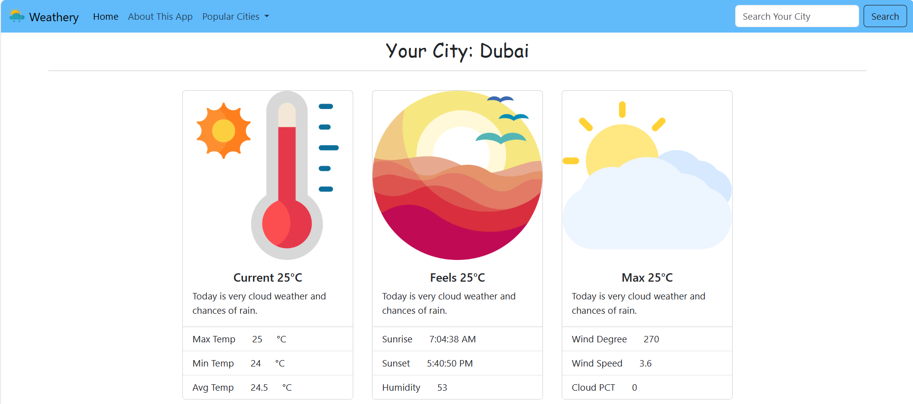

# Wheathery

## Description

Wheathery is a web application designed to provide comprehensive weather information for any given city. The app leverages Weather APIs to fetch real-time weather data, allowing users to search for and stay updated on the latest weather conditions in different locations.

## Features

- **City-specific Weather Information:** Offers detailed weather information for any city, including temperature, humidity, wind speed, and more.
- **Search Functionality:** Enables users to search for weather updates in specific cities, providing localized and relevant information.
- **Weather API Integration:** Consumes Weather APIs to ensure accurate and up-to-date weather data.

## Technology Stack

- **Frontend:** JavaScript, Bootstrap, HTML, CSS
- **Weather Information API:** Weather APIs

## Project Responsibilities

- **API Integration:** Successfully integrated Weather APIs to fetch and display real-time weather information.
- **Frontend Development:** Implemented the user interface using JavaScript, Bootstrap, HTML, and CSS.
- **Search Feature:** Developed functionality for users to search for weather updates in different cities.

## Outcome

Wheathery has proven to be a valuable tool for users seeking timely and accurate weather information. The integration with Weather APIs ensures reliable data, and the user-friendly interface enhances the overall experience for those wanting to stay informed about weather conditions.

